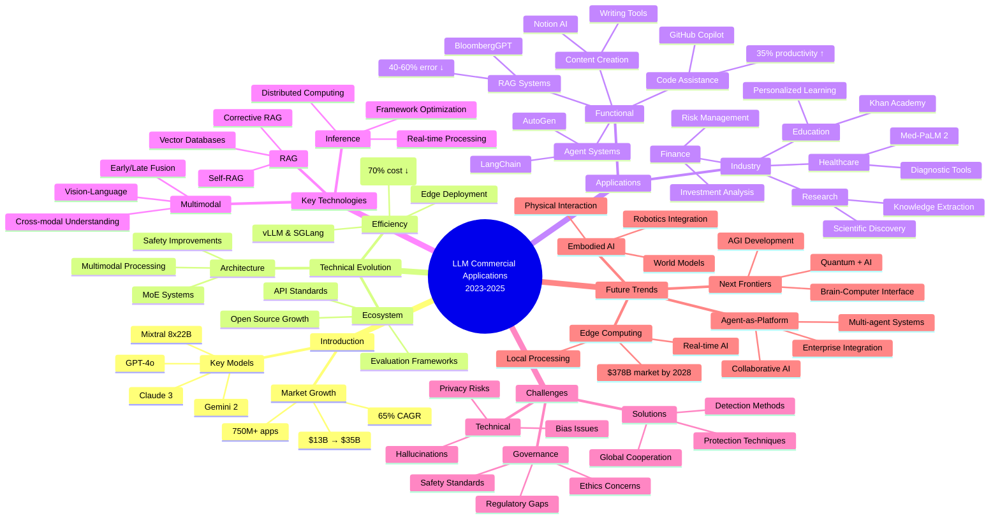

# NeurIPS 2024 Paper Mind Map: Large Language Models Commercial Applications (2023-2025)

```mermaid
mindmap
  root((LLM Commercial Applications<br/>2023-2025))
    Introduction
      Market Growth
        750M+ apps
        $13B → $35B
        65% CAGR
      Key Models
        GPT-4o
        Claude 3
        Gemini 2
        Mixtral 8x22B
    
    Technical Evolution
      Architecture
        Multimodal Processing
        MoE Systems
        Safety Improvements
      Efficiency
        Quantization (70% cost ↓)
        vLLM & SGLang
        Edge Deployment
      Ecosystem
        Open Source Growth
        API Standards
        Evaluation Frameworks
    
    Applications
      Functional
        Content Creation
          Notion AI
          Writing Tools
        Code Assistance
          GitHub Copilot
          35% productivity ↑
        Agent Systems
          LangChain
          AutoGen
        RAG Systems
          BloombergGPT
          40-60% error ↓
      
      Industry
        Education
          Khan Academy
          Personalized Learning
        Healthcare
          Med-PaLM 2
          Diagnostic Tools
        Finance
          Risk Management
          Investment Analysis
        Research
          Scientific Discovery
          Knowledge Extraction
    
    Key Technologies
      RAG
        Self-RAG
        Corrective RAG
        Vector Databases
      Multimodal
        Early/Late Fusion
        Vision-Language
        Cross-modal Understanding
      Inference
        Framework Optimization
        Distributed Computing
        Real-time Processing
    
    Challenges
      Technical
        Hallucinations
        Privacy Risks
        Bias Issues
      Governance
        Regulatory Gaps
        Ethics Concerns
        Safety Standards
      Solutions
        Detection Methods
        Protection Techniques
        Global Cooperation
    
    Future Trends
      Agent-as-Platform
        Multi-agent Systems
        Collaborative AI
        Enterprise Integration
      Edge Computing
        $378B market by 2028
        Local Processing
        Real-time AI
      Embodied AI
        World Models
        Robotics Integration
        Physical Interaction
      
      Next Frontiers
        Quantum + AI
        Brain-Computer Interface
        AGI Development
``` 